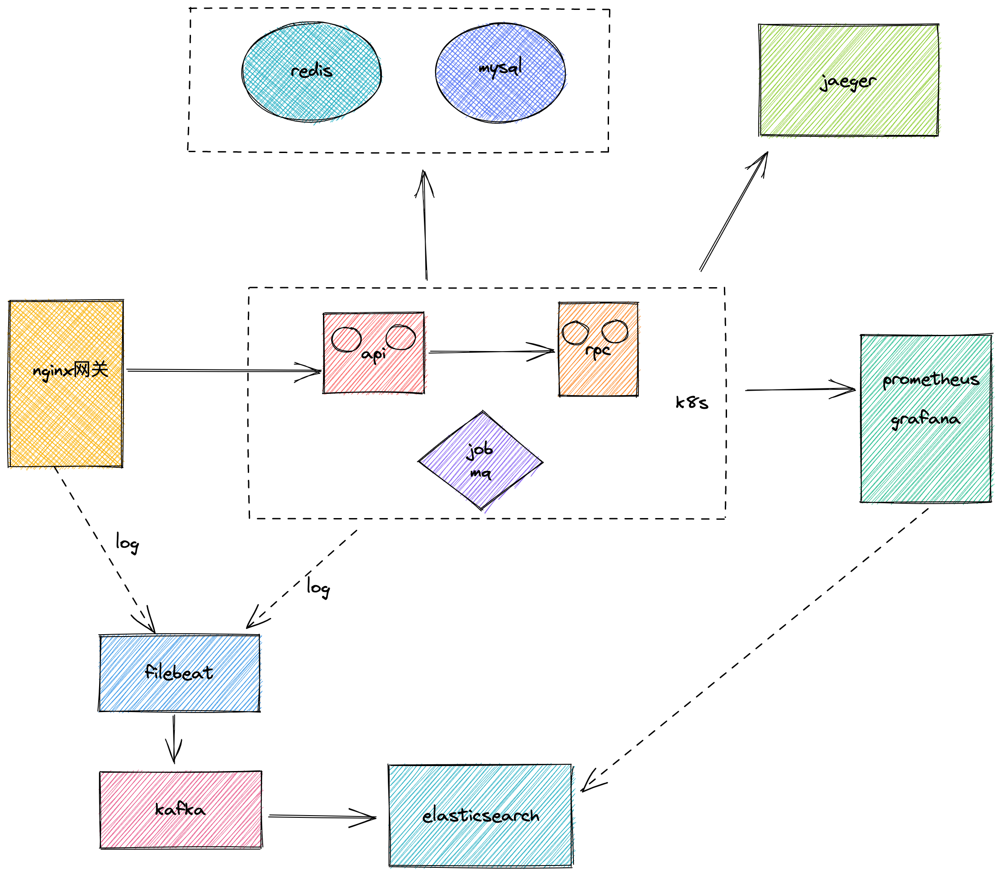
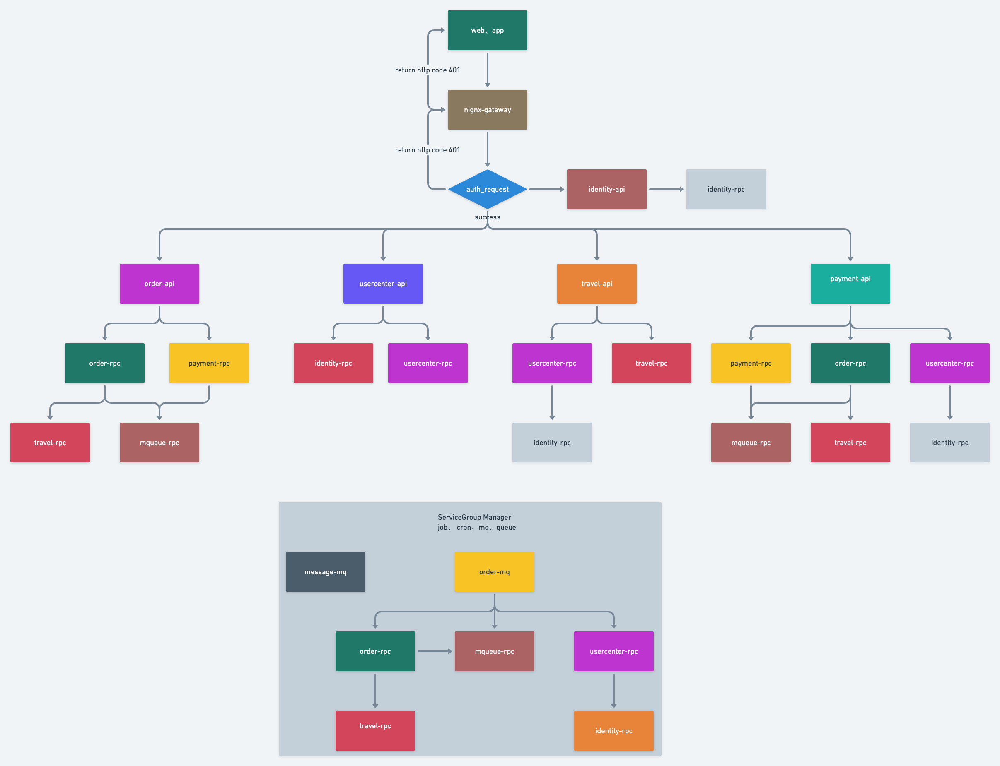
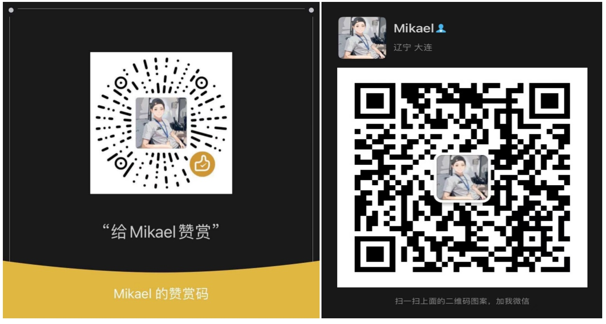

## 前言

#### 老规矩，看之前先给个star哈～～,不star被抓住要打屁股，哈哈哈哈哈哈

因为大家都在说目前go-zero没有一个完整的项目例子，本人接触go-zero可能比较早，go-zero在大约1000star左右我就在用了，后来跟go-zero作者加了微信也熟悉了，go-zero作者非常热心以及耐心的帮我解答了很多问题，我也想积极帮助go-zero推广社区，基本是在社区群内回答大家相关的问题，因为在这个过程中发现很多人觉得go-zero没有一个完整的项目例子，作为想推动社区的一员，索性我就把内部项目删减了一些关键东西，就搞了个可用版本开源出来，主要技术栈包含如下：

- go-zero
- nginx网关
- filebeat
- kafka
- go-stash
- elasticsearch
- kibana
- prometheus
- grafana
- jaeger
- go-queue
- asynq
- asynqmon
- dtm
- docker
- docker-compose
- mysql
- redis
- gin-vue-admin

## 项目文档
https://github.com/Mikaelemmmm/go-zero-looklook/tree/main/doc

本项目开发环境推荐docker-compose，使用直链方式，放弃服务注册发现中间件（etcd、nacos、consul等）带来的麻烦

测试、线上部署使用k8s（也不需要etcd、nacos、consul等）有详细教程（搭建+部署）还在书写中，可以进go-zero社区群沟通，非常easy

## 项目简介

整个项目使用了go-zero开发的微服务，基本包含了go-zero以及相关go-zero作者开发的一些中间件，所用到的技术栈基本是go-zero项目组的自研组件，基本是go-zero全家桶了
另外，前端是小程序，本项目已经对接好了小程序授权登录 以及 微信支付了 ，前端看看后面是否能开源吧

项目目录结构如下：

-  admin：后台代码（整合了gin-vue-admin，充当一个后台大网关），使用grpc与app下的rpc业务交互，后台gin-vue-admin与go-zero的代码交互在banner功能上有个例子可以查看，如果不想要后台，直接删除admin整个文件夹即可
- admin/web : 后台web端代码，gin-vue-admin的

- app：所有业务代码包含api、rpc以及mq（消息队列、延迟队列、定时任务）

- common：通用组件 error、middleware、interceptor、tool、ctxdata等

- data：该项目包含该目录依赖所有中间件(mysql、es、redis、grafana等)产生的数据，此目录下的所有内容应该在git忽略文件中，不需要提交。

- deploy：

    - filebeat: docker部署filebeat配置
    - go-stash：go-stash配置
    - nginx: nginx网关配置
    - prometheus ： prometheus配置
    - script：
        - gencode：生成api、rpc，以及创建kafka语句，复制粘贴使用
        - mysql：生成model的sh工具
    - goctl: 该项目goctl的template，goctl生成自定义代码模版，tempalte用法可参考go-zero文档，复制到家目录下.goctl即可，
      该项目用到goctl版本是v1.3.0

- doc : 该项目系列文档

## 系统架构图

## 业务架构图

## 网关

nginx做网关，使用nginx的auth模块，调用后端的identity服务统一鉴权，业务内部不鉴权，如果涉及到业务资金比较多也可以在业务中进行二次鉴权，为了安全嘛。

另外，很多同学觉得nginx做网关不太好，这块原理基本一样，可以自行替换成apisix、kong等

## 开发模式

本项目使用的是微服务开发，api （http） + rpc（grpc） ， api充当聚合服务，复杂、涉及到其他业务调用的统一写在rpc中，如果一些不会被其他服务依赖使用的简单业务，可以直接写在api的logic中

## 日志

关于日志，统一使用filebeat收集，上报到kafka中，由于logstash懂得都懂，资源占用太夸张了，这里使用了go-stash替换了logstash

链接：https://github.com/kevwan/go-stash  ， go-stash是由go-zero开发团队开发的，性能很高不占资源，主要代码量没多少，只需要配置就可以使用，很简单。它是吧kafka数据源同步到elasticsearch中，默认不支持elasticsearch账号密码，我fork了一份修改了一下，很简单支持了账号、密码

## 监控

监控采用prometheus，这个go-zero原生支持，只需要配置就可以了，这里可以看项目中的配置

## 链路追踪

go-zero默认jaeger、zipkin支持，只需要配置就可以了，可以看配置

## 消息队列

消息队列使用的是go-zero开发团队开发的go-queue，链接：https://github.com/zeromicro/go-queue

这里使用可kq，kq是基于kafka做的高性能消息队列

通用go-queue中也有dq，是延迟队列，不过当前项目没有使用dq

## 延迟队列、定时任务

延迟队列、定时任务本项目使用的是asynq ， google团队给予redis开发的简单中间件，

当然了asynq也支持消息队列，你也可也把kq消息队列替换成这个，毕竟只需要redis不需要在去维护一个kafka也是不错的

链接：https://github.com/hibiken/asynq

## 分布式事务

分布式事务准备使用的是dtm， 嗯 ，很舒服，之前我写过一篇 "go-zero对接分布式事务dtm保姆式教程" 链接地址：https://github.com/Mikaelemmmm/gozerodtm ， 本项目目前还未使用到，后续准备直接集成就好了，如果读者使用直接去看那个源码就行了

## 部署

本项目开发环境推荐docker-compose，使用直链方式，放弃服务注册发现中间件（etcd、nacos、consul等）带来的麻烦

测试、线上部署使用k8s（也不需要etcd、nacos、consul等）有详细教程（搭建+部署）还在书写中，可以进go-zero社区群沟通，非常easy

文档地址：https://github.com/Mikaelemmmm/go-zero-looklook/tree/main/doc

gitlab + jenkins + harbor + k8s

在jenkins中点击部署对应的服务，会去gitlab拉取代码-->再去拉取线上配置（线上配置单独一个git库，为什么不用配置中心，部署文档中有介绍）---->组懂构建镜像-->推送到harbor镜像仓库--->使用kubectl自动发布到k8s中---->前面要挂一个nignx做网关统一入口、鉴权、限流等

## 感谢

go-zero 微服务: https://github.com/zeromicro/go-zero

dtm分布式事务：https://github.com/dtm-labs/dtm

gin-vue-admin后台：https://github.com/flipped-aurora/gin-vue-admin

## 赞赏

